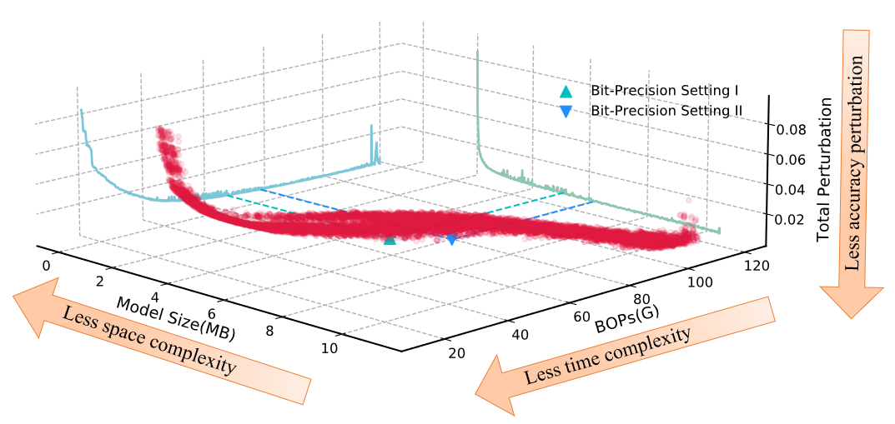

<div align=center>
  
  </div>

# HTQ: Exploring the High-Dimensional Trade-Off of Mixed-Precision Quantization

This repository contains the official PyTorch implementation for the paper *"HTQ: Exploring the High-Dimensional Trade-Off of Mixed-Precision Quantization"*. 

This repository includes the core components of the algorithm, including the calculation of the *sensitivity* and the generation of the *3D Pareto frontier*.

Below are instructions for reproducing the results.

## Install

- **To install HTQ** and develop locally:
  
  ```bash
  git clone https://github.com/zkkli/HTQ.git
  cd HTQ
  ```

## Reproduce the results

- You can reproduce the 3D Pareto frontier of ResNet18 on ImageNet using the following command:

```bash
python main.py --model resnet18 --dataset imagenet --dataset_path [/Path/to/ImageNet/] 

optional arguments:
--model: Model architecture.
--dataset: Dataset type.
--dataset_path: path to dataset.
```
